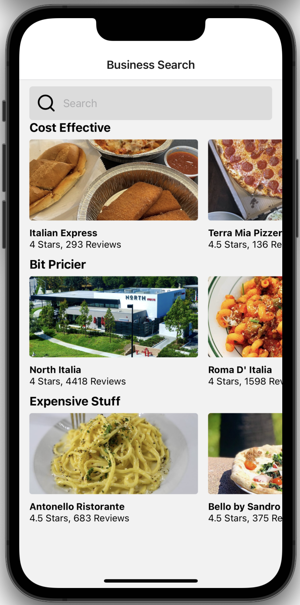
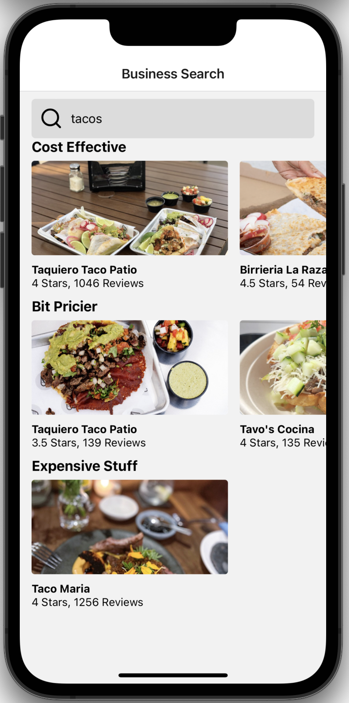

# Mock simple Yelp

One of my early projects for learning React Native. Used Yelp Fusion API to create a restaurant/shop finder. Finds all businesses related to a given search term near Irvine, CA. Results are filtered by the dollar sign category that Yelp assigns to the business (either $, $$, or $$$). You can scroll through the results horizontally and tapping on one takes you to their yelp profile.

Learned about state management, connecting to and parsing data from api's, creating componenets in react and more.

\*see demo at bottom

